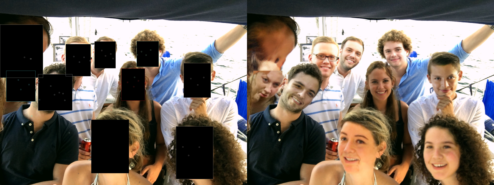

# Face Anonymization

## Installation
Install the following: 
- Pytorch  >= 1.7.0 
- Torchvision >= 0.6.0
- Python >= 3.6

## Run

```
python3 anonymize.py -s input_image.png -t output_path.png
```

## Output


Face Anonymization is a fully automatic anonymization technique for images.



The Face Anonymization GAN utilizes bounding box annotation to identify the privacy-sensitive area, and sparse pose information to guide the network in difficult scenarios.


Face Anonymization detects faces with state-of-the-art detection methods such as [Mask R-CNN](https://arxiv.org/abs/1703.06870) is used to generate a sparse pose information of the face, and [DSFD](https://arxiv.org/abs/1810.10220) is used to detect faces in the image.

